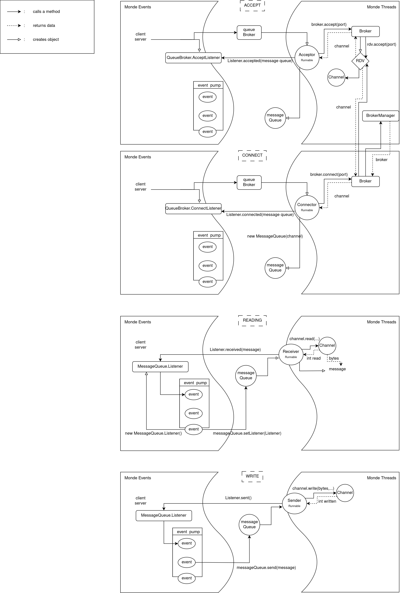

# Specification for an thread-event mixed version
### Overview:

*A module for enabling non-blocking communication between brokers.*

### Queuebroker:

*An abstract class representing a queue broker, responsible for establishing messagequeues.*

    abstract class QueueBroker{

Constructor to initialize the QueueBroker with a name

        QueueBroker(String name);

Non-blocking method to bind the broker to a specific port, a given accept listener is addressed when the broker accepts a connection on a given port

        boolean bind(int port, AcceptListener listener);

Interface for handling accepted connections, methods should be implemented upon creation

        interface AcceptListener {
            void accepted(MessageQueue queue);
        }

Method to unbind the broker from a specific port, returns boolean false if there was nothing to unbind on the given port, returns boolean true if succesfull

        boolean unbind(int port);

Non-blocking method to connect to a queue broker by name and port, the given connect listener will be adressed when connected or refused.

        boolean connect(String name, int port, ConnectListener listener);    
        }

Interface for handling connection events, methods should be implemented upon creation

        interface ConnectListener {
            void connected(MessageQueue queue);
            void refused();
        }

### MessageQueue
*An abstract class representing a messagequeue.*

    abstract class MessageQueue {
    
Interface for handling received messages and closed events, methods should be implemented upon creation

        interface Listener {
            void received(byte[] msg);
            void closed();
        }

Method to set a listener for the message queue

        void setListener(Listener l);

Non-blocking method to send a message as a byte array with a given offset and length. It returns false if the MessageQueue is disconnected, true otherwise. 

        boolean send(byte[] bytes, int offset, int length);

Method to close the message queue
        void close();

Method to check if the message queue is closed
        boolean closed();
    }

### Remaining specification

The remaining specification can be found directly in the source code, with more details: [Queue Broker source code](QueueBroker.java)

### Design

